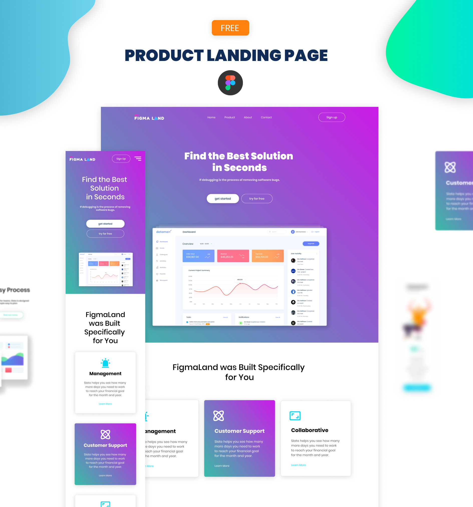

# LandingPage - Figma templates

## O Projeto
LadingPage retirada dos templates do figma, criar webpage responsiva e com validação de formulário. 

## Desafios encontrados
Trabalhar com o position: absolute.

-Este projeto me fez repensar meu conceito e reciclar o conhecimento que já tinha sobre as positions e o flex-box.

## Teconologias Utilizadas
* HTML
* CSS
* JavaScript
* Figma "Templates"
* Github Page "Hospedagem"

## ScreennShot's
* Figma Template

## Agradecimentos

* Muito obrigado a plataforma figma por fornecer estes templates, vocês fazem a diferença.
* "Vida longa e próspera." 🖖
### [Figma - Template: Link direto](https://www.figma.com/file/tirzOrtU6Mzf4T3s3Y9OrQ/Figma-Product-Landing-Page-(Community)?type=design&node-id=38-214&mode=design&t=2T4XkWwFvfEz6pOq-0)

# Author
### Josué Ocanha Costa
#### FrontEnd Developer
#### Redes Sociais

- Linkedin - [JosueOcanhaCosta](https://www.linkedin.com/in/josue-ocanha-costa/)
- Github - [JosueCosta2023](https://github.com/JosueCosta2023)
- Twitter - [@JosueOcanhaCosta](https://twitter.com/josue_ocanha)
- Facebook - [JosueCosta](https://www.facebook.com/JosueOcanhaCosta2023)
- Whatsapp - [Josue2023](https://wa.me/5565996408371?text=Ol%C3%A1%2C+encontrei+seu+whatsapp+no+Github.+Gostaria+de+falar+sobre+seus+projetos.)
